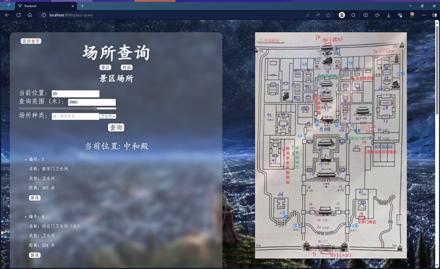

# 项目概述

## 项目背景
本项目旨在开发一款学生游学系统，以满足学生利用假期进行游学活动的管理需求。

该系统旨在为学生提供便捷的游学活动管理功能，包括游学推荐、游学路线规划、场所查询以及游学日记管理等核心功能。

通过该系统，学生可以更好地组织和记录自己的游学经历，提开游学活动的效率和体验。

## 项目需求
实现一个具备游学推荐、游学路线规划、场所查询、游学日记管理等功能的学生游学系统，具体需求如下：

1)	游学前准备：
>
> 游学推荐：根据游学热度、评价和个人兴趣推荐游学目的地。
>
>游学查询：输入名称、类别、关键字等信息来查询景点和学校；

2)	游学中体验：
>
>参观线路规划：在校园和景点内部规划最优参观路线。
>
>景点介绍与场所查询：在游览过程中提供景点介绍和场所信息查询。

3)	游学后回顾：
>
>游学日记管理：根据照片和游览经历生成游学日记。
>
>游学日记下载：游学日记数据应进行无损压缩存储，以优化存储空间。

# 系统架构


 
+ 在本系统中，前端采用Vue.js 3.0技术开发，为用户提供直观的操作界面。

+ 用户在前端界面上执行操作，例如登录、注册、搜索游学日记等，这些操作会触发前端通过Axios库发送HTTP请求到后端服务器。

+ 后端服务器基于Node.js和Express.js构建，专门负责处理这些HTTP请求。

+ 后端服务器接收到前端的请求后，会根据请求的类型调用相应的API端点，如/api/login、/api/recommendation、/api/register等。

+ 这些API端点实际上是Node.js使用child_process.spawn方法调用的C++ 编写的后端程序。这些程序直接与MySQL 8.0数据库交互，存储和检索用户信息、游学日记和路线规划数据。

+ 任务执行完毕后，C++ 程序将结果或错误信息返回给Node.js服务器，服务器再将这些信息封装成HTTP响应发送回前端。前端接收到响应后，根据内容更新用户界面，完成用户操作的闭环。

# 仓库内容介绍

``` bash
├── DataStructCourseDesign
│   ├── Data        (使用的数据)
│   ├── Docs        (文档周报等)
│   ├── photos      (README的图片)
│   ├── Slides      (项目要求、验收评分标准)
│   ├── src_all     (前后端源代码)
│   ├── 开发者日志.md
│   └── README.md
```

---

# 放几张我们的游学系统图片





